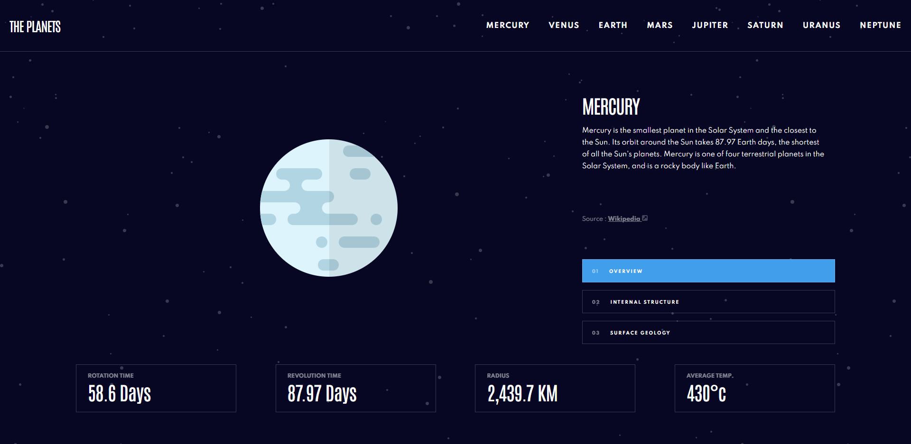

# Frontend Mentor - Planets fact site solution

This is a solution to the [Planets fact site challenge on Frontend Mentor](https://www.frontendmentor.io/challenges/planets-fact-site-gazqN8w_f). Frontend Mentor challenges help you improve your coding skills by building realistic projects.

## Table of contents

- [Overview](#overview)
  - [The challenge](#the-challenge)
  - [Screenshot](#screenshot)
  - [Links](#links)
- [My process](#my-process)
  - [Built with](#built-with)
  - [What I learned](#what-i-learned)
  - [Continued development](#continued-development)
- [Author](#author)
- [Acknowledgments](#acknowledgments)

**Note: Delete this note and update the table of contents based on what sections you keep.**

## Overview

### The challenge

Users should be able to:

- View the optimal layout for the app depending on their device's screen size
- See hover states for all interactive elements on the page
- View each planet page and toggle between "Overview", "Internal Structure", and "Surface Geology"

### Screenshot

### Links

- Solution URL: [https://www.frontendmentor.io/solutions/responsive-planet-fact-website-YJIHGea31](https://www.frontendmentor.io/solutions/responsive-planet-fact-website-YJIHGea31)
- Live Site URL: [https://fem-planet-fact-site.onrender.com/](https://fem-planet-fact-site.onrender.com/)
- Github Page: [https://github.com/rperry99/FM-Planet-Fact-Site](https://github.com/rperry99/FM-Planet-Fact-Site)

## My process

### Built with

- SCSS custom properties
- Flexbox
- CSS Grid
- Mobile-first workflow
- JQuery for Interatability
- JSON Files

### What I learned

- I learned how to work with a local JSON file. I was able to create a website that feels like it's actually 8 different pages, but it is really one page where the content updates dynamically.

### Continued development

- I would like to continue working on my SCSS skills and possibly improve my workflow for it.

## Author

- Website - [Hashnode Blog](https://russdevs.hashnode.dev/)
- Frontend Mentor - [@rperry99](https://www.frontendmentor.io/profile/rperry99)
- Twitter - [@RussDevs](https://twitter.com/russdevs)

## Acknowledgments

This is where you can give a hat tip to anyone who helped you out on this project. Perhaps you worked in a team or got some inspiration from someone else's solution. This is the perfect place to give them some credit.

**Note: Delete this note and edit this section's content as necessary. If you completed this challenge by yourself, feel free to delete this section entirely.**
